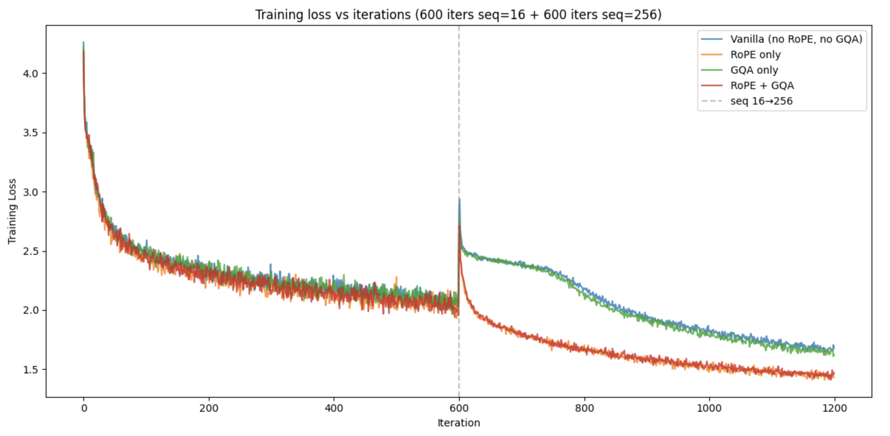

# MiniGPT with RoPE and GQA

## Background

This project builds upon the original [minGPT](https://github.com/karpathy/minGPT) starter code authored by Andrej Karpathy. The implementation has been upgraded to incorporate two key ingredients found in state-of-the-art LLMs such as LLAMA-2.

## Key Features

### Rotary Position Embeddings (RoPE)
Replaces the existing absolute position embeddings with a relative position embedding mechanism that rotates small segments of each key and query vector.

### Grouped-Query Attention (GQA)
An optimized attention mechanism that, while fundamentally still causal attention, enables the model to use less memory and run faster compared to standard multi-head attention.

## Configuration

All parameters printed in the config can be modified by passing flags to `chargpt.py`. 

## Training

The model was trained on Google T4 GPU. Performance comparisons can be seen below:



## Usage

```bash
python src/chargpt.py [flags]
```
